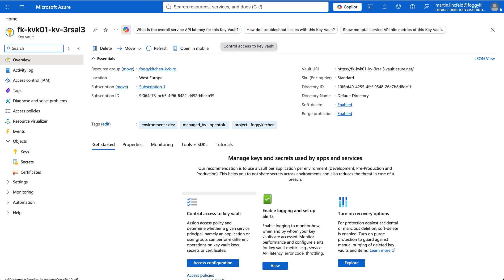
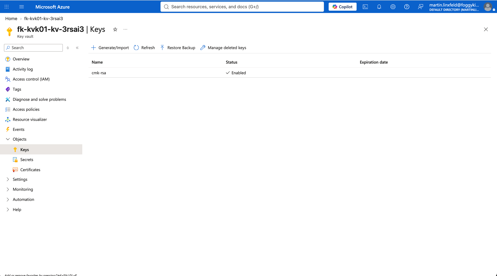
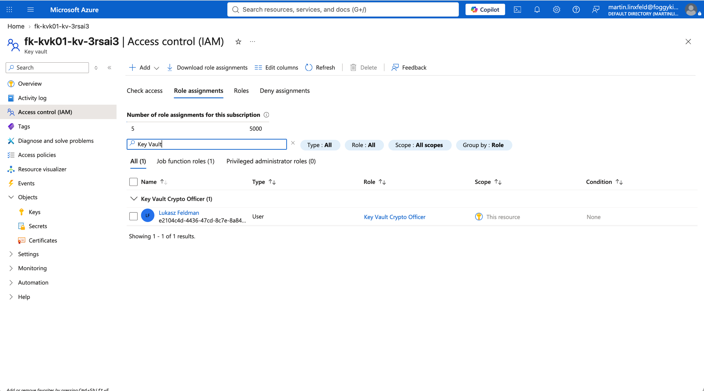

# Example 01: RSA Key Vault Key

In this first Key Vault key example, we deploy an **Azure Key Vault key**
using **Terraform/OpenTofu**.
The Key Vault is created by the Key Vault module, the current OpenTofu principal
receives key management permissions through Azure RBAC, and the key itself is
created by the local `terraform-az-fk-key-vault-key` module.

This example focuses on the simplest reusable key lifecycle pattern for
customer-managed key labs. It uses a **standard Azure Key Vault** and a
software-backed **RSA 4096-bit key**. It does not use Premium Key Vault,
Managed HSM, or HSM-backed keys.

---

## Architecture Overview

This deployment creates:

- A dedicated **Azure Resource Group**
- One **Azure Key Vault** using `terraform-az-fk-key-vault`
- One Azure RBAC role assignment using `terraform-az-fk-rbac`
- One **RSA 4096-bit Key Vault key** using the local `terraform-az-fk-key-vault-key` module
- Versioned and versionless key IDs exposed as outputs

This is the most direct way to understand how the Key Vault key module behaves
when composed with the surrounding Key Vault and RBAC layers.

---

## Deployment Steps

Copy the example variables file:

```bash
cp terraform.tfvars.example terraform.tfvars
```

Initialize and apply the Terraform/OpenTofu configuration:

```bash
tofu init
tofu plan
tofu apply
```

After a successful deployment, OpenTofu will output:

- The Key Vault ID
- The Key Vault name
- The versioned Key Vault key ID
- The versionless Key Vault key ID
- The versionless Azure resource ID of the Key Vault key

These outputs make it easy to pass the key into downstream customer-managed key
integrations such as Azure Database for PostgreSQL Flexible Server encryption.

---

## Runtime Notes

After deployment, the Key Vault should:

- use the standard pricing tier
- have soft-delete enabled
- have purge protection enabled
- use Azure RBAC for data-plane authorization
- contain one enabled RSA key named `cmk-rsa`

The Azure identity running this example needs permission to create resource groups,
Key Vaults, role assignments, and Key Vault keys.

Customer-managed key integrations usually consume the versionless key ID rather
than a specific key version.

---

## Azure Console And Runtime Verification

### Key Vault Overview

In the Azure portal, verify that the Key Vault exists in the expected resource group
and region, uses the standard SKU, and has soft-delete and purge protection enabled.



### Key List

Confirm that the `cmk-rsa` key exists and is enabled.



### Key Vault RBAC

Confirm that the current OpenTofu principal has the `Key Vault Crypto Officer`
role assignment on the Key Vault scope.



---

## Cleanup

To remove all resources created by this example:

```bash
tofu destroy
```

---

## Summary

This example demonstrates:

- How to create an **Azure Key Vault key** using Terraform/OpenTofu
- How to keep Key Vault lifecycle outside the root key module
- How to compose key management permissions with `terraform-az-fk-rbac`
- How to expose both versioned and versionless key IDs
- How to keep key labs cost-conscious by using software-backed keys

---

## Learn More

Visit [FoggyKitchen.com](https://foggykitchen.com/) for Azure, OCI, multicloud, and Terraform/OpenTofu learning resources.

---

## License

Licensed under the **Universal Permissive License (UPL), Version 1.0**.
See [LICENSE](../../LICENSE) for more details.

---

© 2026 [FoggyKitchen.com](https://foggykitchen.com) - Cloud. Code. Clarity.
